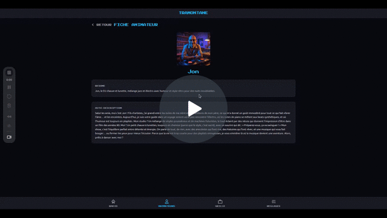
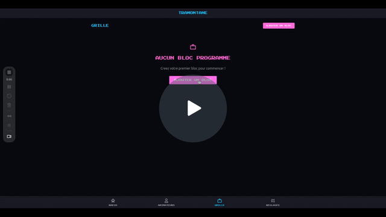
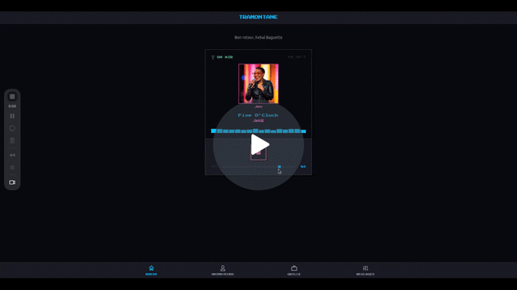
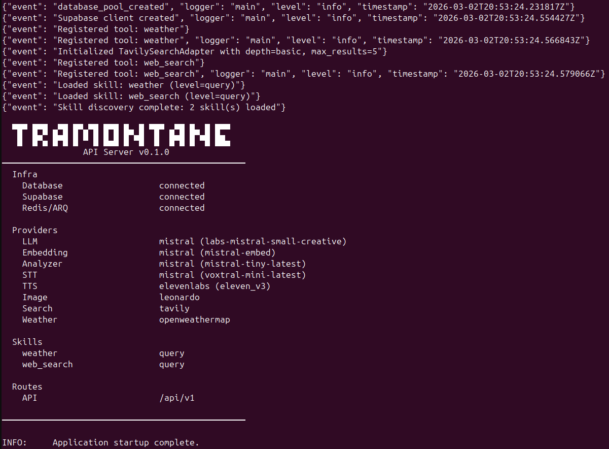
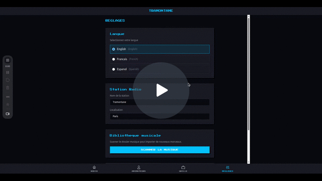
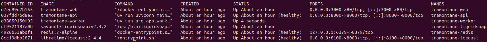

# Tramontane

Autonomous self-hosted web radio powered by AI.

**Mistral Worldwide Hackathon — February 2026 (Online Edition)**

## What is it

Tramontane is a platform for running AI-driven web radio stations. Define radio hosts with their own personality, background, and style. Set the radio theme, topics of interest, manage planning and scheduling, and let the AI handle the rest autonomously. Today hosts deliver block openings (with live weather & news), song transitions (reacting to the previous track and teasing the next), and handoffs between hosts. Interviews, podcasts, and dedicated talk segments are on the roadmap.

## Mistral models usage

Mistral is the core AI engine — all text generation, analysis, and embeddings run on Mistral models. Image generation uses Leonardo AI, voice synthesis uses ElevenLabs.

| Model | Type | Env var | Purpose |
|-------|------|---------|---------|
| `labs-mistral-small-creative` | LLM (chat) | `LLM_MODEL` | Host personality enrichment, on-air transition scripts, block openings/closings, music curation from candidate shortlist, tool-calling (weather & news during openings) |
| `mistral-embed` | Embedding | `EMBEDDING_MODEL` | Track metadata embedding into pgvector for semantic music selection |
| `mistral-tiny-latest` | Analyzer (structured JSON) | `ANALYZER_MODEL` | **Planned** — LLM-based genre/mood auto-tagging during music scan (adapter ready, not yet wired) |
| `voxtral-mini-latest` | Speech (STT) | `STT_MODEL` | **Planned** — transcribe listener voice messages so the host can react on air, conduct live on-air interviews |

- **LLM** — the creative workhorse. Used at host creation (generates the full personality profile from a template + user input), and at runtime for every on-air segment (block openings with live data, song transitions, host handoffs, music curation). Supports tool-calling via the AIGateway orchestrator so the LLM can fetch weather and news mid-generation. This version uses `labs-mistral-small-creative` — easily swappable to `mistral-small-latest`, `mistral-large-latest`, etc. via the `LLM_MODEL` env var.
- **Embedding** — `mistral-embed` (default, configurable via `EMBEDDING_MODEL`) is called during scan to vectorize track metadata (`"title by artist | genre | mood"`) into pgvector. At runtime, the block description is embedded with the same model and compared via cosine similarity to find matching tracks.
- **Analyzer** — structured JSON adapter (`mistral-tiny-latest`). The adapter and provider are ready but not yet wired into the scan pipeline. Currently genre/mood tags come from ID3 metadata only. Next step: call the analyzer during scan to auto-tag tracks that have sparse or missing ID3 tags. Configurable via `ANALYZER_MODEL`.
- **Voxtral** (`voxtral-mini-latest`, configurable via `STT_MODEL`) — planned for listener interaction: transcribe voice messages from chat so the host can react on air, and conduct live on-air interviews where the host listens and responds to callers in real time.

## Features

### Create a host

Pick a personality template (Chill DJ, Comedy Host, Culture Reviewer, Journalist), give them a name, choose a tone and backstory. Mistral generates the full personality profile — a rich self-description, system prompt, and avatar generation prompt — all in the language configured in your station settings. Leonardo AI then generates a unique avatar asynchronously. Each host has their own voice (ElevenLabs), speaking style, and on-air personality that stays consistent across every segment they deliver.

Templates are fully YAML-driven — every system prompt, transition template, and personality trait lives in a plain text file you can edit without touching code. Host-specific data (description, enrichment output) is stored as JSONB in Postgres, so adding new fields or tweaking prompts requires no migrations.



### Schedule the radio

Define schedule blocks with time slots and assign a host to each one. Blocks can be `bloc_music` (mostly music) or `bloc_talk` (more host commentary). The host currently speaks between every track. The schedule engine runs autonomously — it reads the active block, dispatches content, and handles host handoffs at block boundaries ("Thanks for listening! I'm passing the mic to Marco..."). Outside scheduled hours, the stream plays fallback music with no AI cost.



### AI-driven music selection

The host picks every song. When the schedule engine needs a new track, it embeds the block description (e.g. "chill electronic vibes, lo-fi and ambient") with `mistral-embed` and runs a pgvector cosine similarity query against the track embeddings built during scan. The top 20 candidates are fetched, excluding recently played tracks to avoid repeats. Then Mistral picks the final track from that shortlist — the LLM sees each candidate's title, artist, genre, and mood, and chooses the best fit considering energy arc and variety. The host then introduces or comments on the track in character.

This is the hackathon version — the similarity is purely based on text embeddings of metadata strings (`"title by artist | genre | mood"`), which is straightforward but effective enough for a demo. A refined version would factor in audio features, listener feedback, time-of-day preferences, and smoother energy transitions across a full block.

### Radio player



### Live block openings with weather & news

When a host goes on air, the engine forces a weather lookup and a news search before generating the opening script. This is intentional — the opening is the demo's "wow" moment: the host greets listeners, mentions the actual temperature and conditions in your city, then picks a real headline from today's news and reacts to it in character, all in the station language. It proves the full pipeline end-to-end: skill tool-calling (weather via OpenWeatherMap, news via Tavily), LLM script generation with live data injected into the prompt, TTS synthesis, and push to Liquidsoap — in a single seamless segment. Block openings are longer and richer than regular transitions, giving each show a distinct "going live" feel.

### Host transitions between every track

Between each song, the host reacts to the previous track and introduces the next one in character. Mistral generates short, varied transition scripts (1-2 sentences) using the host's personality template. Every transition is synthesized via ElevenLabs TTS and pushed to Liquidsoap ahead of the music track.

### Host skills & tool-calling

Hosts have a skill system backed by Mistral's tool-calling API. During content generation, the AIGateway orchestrator lets the LLM invoke tools mid-conversation — it calls a tool, receives the result, and weaves it into the script naturally. Two built-in skills ship today: **weather** (OpenWeatherMap — current conditions and temperature) and **web search** (Tavily — live news headlines). Skills are auto-discovered at startup from YAML manifests, so adding new ones (e.g. traffic, sports scores) requires no code changes to the orchestrator.

### Roadmap

| Phase | Status | What |
|-------|--------|------|
| 1. Audio Pipeline | Done | Icecast + Liquidsoap streaming, music ingest, web player |
| 2. Host & Schedule | Done | Host creation, templates, avatars, schedule blocks |
| 3. LLM Content Engine | Done | Schedule engine, music selection, transitions, TTS, live weather & news in openings |
| 4. Listener Chat | Next | WebSocket chat, host references messages on air, mood influence |
| 5. Advanced Segments | Planned | Dedicated news bulletins, weather forecasts, interview format |
| 6. Schedule UI Polish | Planned | Visual schedule management, drag & drop, demo polish |

### Audio pipeline
- Icecast + Liquidsoap streaming with crossfade transitions
- Music ingest pipeline (MP3, FLAC, OGG) with automatic metadata extraction (genre, mood, artist)
- Retro pixel-art web player with visualizer, volume control, and now-playing display
- Fallback source ensures the stream never goes silent
- Track push via Harbor HTTP API

### Access control
- Supabase JWT authentication (Google OAuth)
- Role-based UI: all authenticated users can browse hosts and view host profiles; admin users can create, delete, and regenerate avatars
- Admin-only management: host creation/deletion, schedule, settings, ingest, radio push (configured via `ADMIN_EMAILS`)
- Public endpoints: radio player (now-playing), active schedule block, personality templates
- i18n support (English, French, Spanish)



## Stack

- **Backend:** FastAPI + asyncpg + Supabase (auth, DB, storage)
- **Frontend:** Vue 3 + Vite + Tailwind CSS + Pinia
- **AI:** Mistral (LLM, embeddings, STT, analysis)
- **Image:** Leonardo AI (avatar generation)
- **TTS:** ElevenLabs
- **Search:** Tavily
- **Weather:** OpenWeatherMap
- **Streaming:** Icecast + Liquidsoap
- **Workers:** ARQ (Redis-based async job queue)
- **Infra:** Docker Compose

## Prerequisites

### 1. Supabase project

Create a free project at [supabase.com](https://supabase.com):

1. Create a new project
2. Fill in the Supabase env keys in `.env`
3. Use the **transaction pooler** connection string for `DATABASE_URL`
4. Create a **private** storage bucket named `pictures` (used for host avatars)

### 2. Google OAuth

Set up Google SSO for authentication:

1. Go to [Google Cloud Console > Credentials](https://console.cloud.google.com/apis/credentials)
2. Create (or select) an OAuth 2.0 Client ID (type: Web application)
3. Add to **Authorized JavaScript origins:**
   - `http://localhost:3000`
4. Add to **Authorized redirect URIs:**
   - `https://<your-project-ref>.supabase.co/auth/v1/callback`
5. Copy Client ID and Client Secret
6. In Supabase Dashboard, go to **Authentication > Providers > Google**:
   - Enable Google provider
   - Paste Client ID and Client Secret

### 3. API keys

| Service | Key | Required |
|---------|-----|----------|
| Mistral | `MISTRAL_API_KEY` | Yes |
| Leonardo AI | `LEONARDO_API_KEY` | For avatar generation |
| ElevenLabs | `ELEVENLABS_API_KEY` | For TTS (Phase 3) |
| Tavily | `TAVILY_API_KEY` | For web search skill |
| OpenWeatherMap | `OPENWEATHER_API_KEY` | For weather skill |
| Admin access | `ADMIN_EMAILS` | JSON list of admin emails, e.g. `["you@example.com"]` |

## Quick start

```bash
# Configure backend
cp .env.example .env
# Fill in Supabase, Mistral, and tool API keys

# Configure frontend
cp web/.env.example web/.env
# Set VITE_SUPABASE_URL and VITE_SUPABASE_PUBLISHABLE_KEY

# Run with Docker (from project root)
docker compose -f docker/docker-compose.yml up --build -d
# Starts: api, web, worker, redis, icecast, liquidsoap
```

| Service | URL |
|---------|-----|
| Frontend | http://localhost:3000 |
| API | http://localhost:8000 |
| Swagger docs | http://localhost:8000/docs |
| Radio stream | http://localhost:8100/stream.mp3 |

### Configure settings first

Before creating hosts, go to **Settings** in the UI and set your station language (English, French, or Spanish). Host creation uses this language for LLM enrichment — the host personality, description, and on-air speech will all be generated in that language.

### Add music

Drop MP3/FLAC/OGG files into the `/music/` directory (mapped as a Docker volume to api, worker, and liquidsoap containers). Then scan from the **Settings** page in the UI — click the scan button to trigger the ingest pipeline.



The scan runs in three stages:

1. **File discovery** — recursively walks the directory for MP3, FLAC, OGG, and WAV files.
2. **Metadata extraction** — reads ID3/Vorbis tags with mutagen (title, artist, album, duration, genre, mood). Genre tags with multiple values (`Rock; Blues / Country`) are split automatically. Each track is upserted into Postgres (idempotent — re-run anytime to pick up new files).
3. **Embedding** — once the scan finishes, an ARQ background job embeds every new track via `mistral-embed`. The text representation is `"{title} by {artist} | genre: {genre} | mood: {mood}"`, stored as a pgvector column. This is what powers the semantic music selection later — the schedule engine queries the embedding space with the block description to find tracks that match the vibe.

You can also scan via API:

```bash
curl -X POST http://localhost:8000/api/v1/ingest/scan \
  -H "Authorization: Bearer $TOKEN" \
  -H "Content-Type: application/json" \
  -d '{"directory": "/music"}'
```

## How it works

### Architecture overview

```
┌──────────┐    ┌────────────┐    ┌───────────┐   ┌────────────┐
│  Vue 3   │◄──►│  FastAPI   │◄──►│  Supabase │   │   Redis    │
│ frontend │    │   API      │    │ (Postgres)│   │            │
└──────────┘    └────────────┘    └───────────┘   └─────┬──────┘
                                                        │
                ┌────────────┐                    ┌─────┴──────┐
                │ Liquidsoap │◄───── push ────────│ ARQ Worker │
                │  (playout) │                    │            │
                └─────┬──────┘                    └────────────┘
                      │                           │  schedule_tick (30s cron)
                      ▼                           │  calls: Mistral, ElevenLabs
                ┌────────────┐                    │  pushes: tracks + voice
                │  Icecast   │                    │
                │ (stream)   │──► listeners       │
                └────────────┘                    │
```



**Six containers run in Docker:**
1. **api** — FastAPI serving the REST API
2. **web** — Vue 3 + Vite frontend
3. **worker** — ARQ background worker running the schedule engine cron + async jobs
4. **redis** — state store for ARQ jobs and schedule engine cross-tick persistence
5. **liquidsoap** — playout engine, receives track + voice pushes via Harbor HTTP
6. **icecast** — stream server, serves the MP3 stream to listeners

### Worker jobs

The ARQ worker runs one cron job and four on-demand tasks:

| Job | Trigger | What it does |
|-----|---------|--------------|
| `schedule_tick` | Cron every 30s | Core engine loop — checks active block, manages buffer budget, dispatches track + voice segments to Liquidsoap |
| `generate_host_avatar` | On host creation/enrichment | Calls Leonardo AI to generate a host avatar asynchronously |
| `generate_content_segment` | Pre-generation or manual trigger | Generates and pushes a voice segment (opening/closing/track intro) for a schedule block |
| `generate_bumpers_task` | On demand | Generates station bumper phrases via Mistral + ElevenLabs TTS |
| `embed_tracks_task` | After music scan | Embeds track metadata (title, artist, genre, mood) into pgvector via Mistral Embed |

### Schedule engine flow

The worker runs `schedule_tick` every 30 seconds. It uses a **budget-based model** — tracking estimated seconds of audio queued in Liquidsoap and only pushing when the buffer runs low (< 30s).

```
schedule_tick (every 30s)
│
├── No active block? → dead hour, push nothing, Liquidsoap plays fallback
│
├── Cold start? (worker just booted into active block)
│   └── Flush stale queue → select first track → push BLOCK_OPENING voice
│       + first track → set budget
│
├── Block transition? (different block than last tick)
│   └── Push BLOCK_OPENING for new host (with previous host name handoff)
│
├── Near block end? (< 60s remaining)
│   └── Push BLOCK_CLOSING voice (with next host name) + last track → stop feeding
│
├── Budget > 30s? → skip, queue still has audio
│
└── Budget low → select track → generate transition voice → push both
    └── Budget += track_duration + TTS_duration
```

Each push sequence lands in Liquidsoap's queue:
```
[voice: "Et maintenant, un petit bijou..."]  (~8s TTS)
[music: /music/Fire_-_Seth_Power.mp3]         (~210s)
```

### Content pipeline

```
Mistral selects track        Mistral writes script       ElevenLabs speaks it
(pgvector + LLM curation) → (host personality prompt) → (TTS synthesis)
                                                              │
                                                              ▼
                                                    /music/generated/{id}.mp3
                                                              │
                                              Liquidsoap push (voice then track)
```

Prompt flow for a transition:
1. **System prompt** = `core_identity_template` (host personality) + `output_format_voice` (TTS rules, variation instructions) + runtime context (time of day, block description, recent tracks)
2. **User prompt** = segment-specific template (`block_opening_template`, `track_intro_template`, etc.) + track info + handoff host name if applicable

Each template includes variation instructions like "VARY your opening -- never start two transitions the same way" to prevent repetitive output.

### Host prompt templates

Every host template is a single YAML file (`app/features/hosts/templates/`). The `prompt_templates` section contains all the on-air prompts — editing a YAML file is all it takes to change how a host behaves. The templates currently used by the schedule engine:

| Template | Role | Used as |
|----------|------|---------|
| `core_identity_template` | Defines who the host is: name, self-description (from LLM enrichment), broadcast language, on-air style | System prompt (always present) |
| `output_format_voice` | TTS output rules: short sentences, action markers for emotion (`*sigh*`, `*laughs*`), filler words, pause markers (`...`), variation instructions | Appended to system prompt |
| `block_opening_template` | Structured opening script: greet + weather + news headline + tease next track. Strict numbered format so the LLM doesn't ramble | User prompt on block start |
| `track_intro_template` | React to previous track, introduce the next one. 1-2 sentences, must vary the opening every time | User prompt between songs |
| `block_closing_template` | Wrap up the show, thank listeners, hand off to the next host by name | User prompt at block end |
| `enrichment_prompt` | Used at host creation — Mistral generates the personality profile (self_description, short_summary, avatar_prompt) from user form input | One-shot LLM call on create |
| `avatar_style_hint` | Visual description passed to Leonardo AI for avatar generation, also injected into `enrichment_prompt` so the LLM writes a matching avatar prompt | Leonardo image generation |
| `fallback_identity` | Fallback self-description if the host has no enrichment data yet | System prompt fallback |

Beyond the YAML templates, two more prompt sources are used at runtime:

- **Skill prompts** (`app/features/hosts/skills/weather/prompt.md`, `web_search/prompt.md`) — short instructions telling the LLM how to use each tool. Injected into the user message during block openings so the host can reference live weather and news naturally.
- **Music curation prompt** (`music_selector.py`) — system prompt for LLM-driven track selection. Given the block description and a shortlist of pgvector candidates, the LLM picks the best track considering genre, mood, energy arc, and variety.

The prompt builder (`prompt_builder.py`) assembles the final LLM call at runtime: system prompt = `core_identity_template` + `output_format_voice` + runtime context (datetime, location, block info, track history). User prompt = the segment-specific template + skill prompt results (weather data, news headlines) + track metadata + handoff host name.

### Testing block openings

The engine only pushes a BLOCK_OPENING on cold start or block transition. To force one during development:

**Option 1: Restart the worker** (triggers cold start)
```bash
# Flush Liquidsoap queue + restart worker
curl -X POST http://localhost:8080/flush
docker restart tramontane-worker
```
The worker boots, detects an active block with no `current_block_id` in ctx, flushes stale audio, and pushes a fresh BLOCK_OPENING + first track.

**Option 2: Flush via Liquidsoap directly**
```bash
# Clear the queue (removes all pending tracks)
curl -X POST http://localhost:8080/flush

# Check queue is empty
curl http://localhost:8080/queue-status
# → {"length": 0, ...}
```
On the next tick (within 30s), the engine sees budget = 0 and pushes new content. This won't trigger a BLOCK_OPENING though — only a normal track push. For an actual opening, restart the worker.

**Option 3: Delete the Redis cold-start guard**
```bash
docker exec tramontane-redis redis-cli DEL cold_start_done
docker restart tramontane-worker
```

## Project structure

```
app/
├── core/              # Config, auth, database, middleware, logging
├── features/
│   ├── auth/          # Supabase auth
│   ├── content/       # Schedule engine, music selector, transitions, TTS pipeline, prompts
│   ├── hosts/         # Host CRUD, templates, LLM enrichment, skills
│   ├── ingest/        # Music ingest pipeline (scan, metadata, tagging)
│   ├── radio/         # Streaming API, now-playing, Liquidsoap/Icecast clients
│   ├── schedule/      # Schedule block CRUD, overlap validation, active block
│   └── settings/      # Per-user radio settings (language, location)
├── providers/         # Pluggable adapters (LLM, embedding, TTS, STT, image, search, weather)
└── workers/           # ARQ worker config + cron jobs
web/                   # Vue 3 + Vite + Tailwind frontend
├── components/        # Radio player, host cards, schedule timeline
├── views/             # Pages (hosts, schedule, settings, auth)
├── stores/            # Pinia stores (auth, player, hosts, schedule)
└── locales/           # i18n (en, fr, es)
docker/                # Dockerfiles, docker-compose, Icecast/Liquidsoap config
docs/                  # Design docs (schedule engine, content pipeline)
supabase/              # Database migrations
tests/                 # pytest (254 tests)
```

## License

MIT
