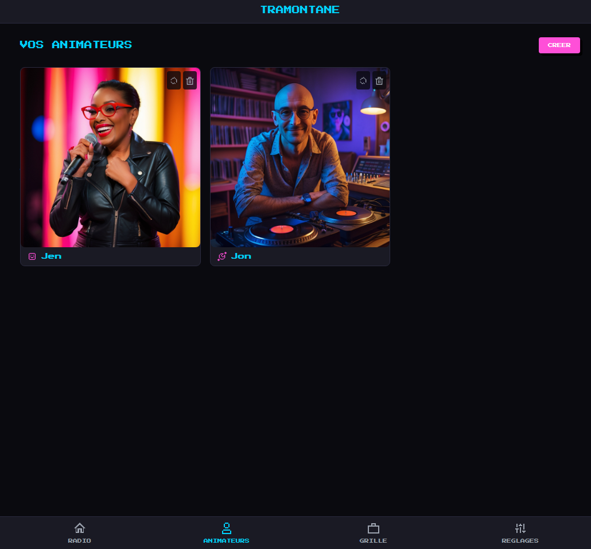
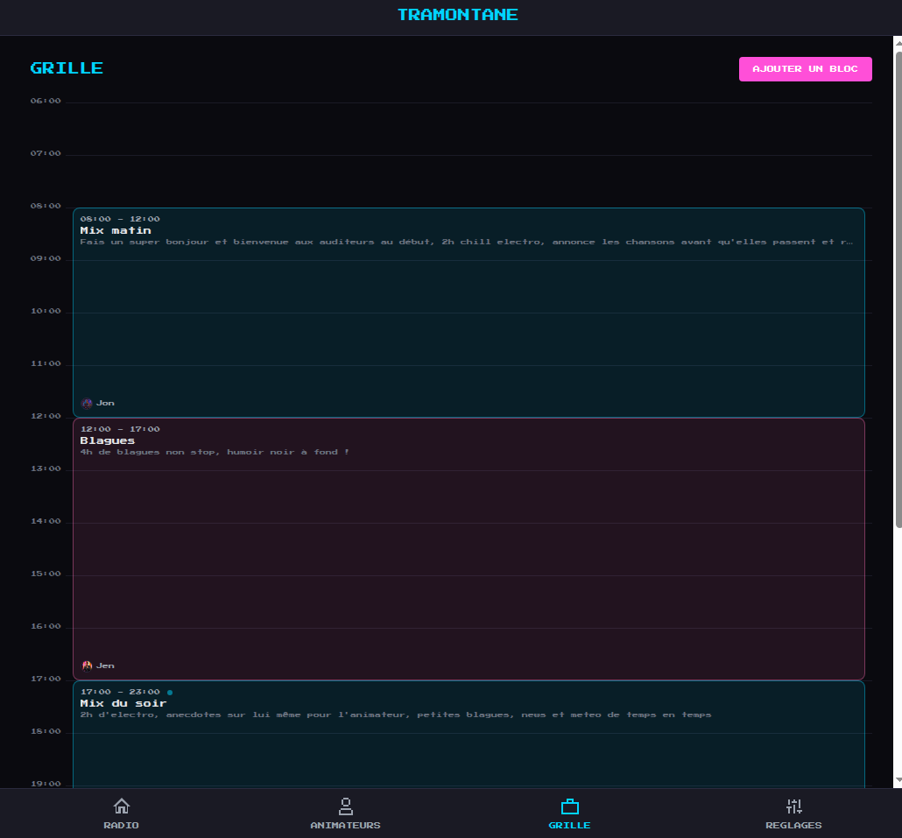
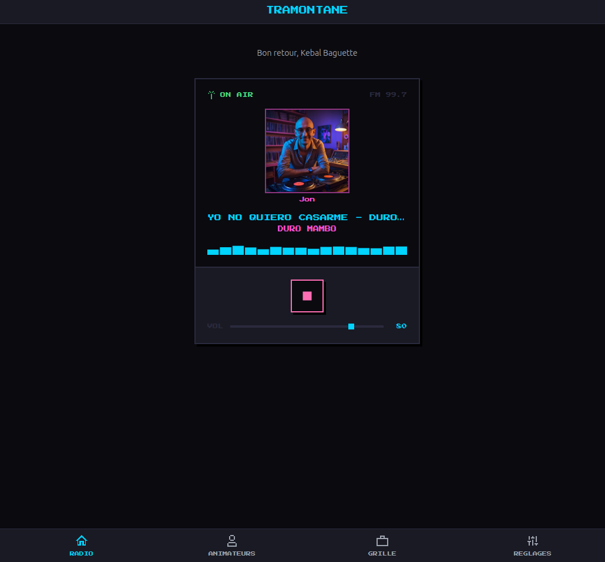

# Tramontane

Autonomous self-hosted web radio powered by AI.

**Mistral Worldwide Hackathon — February 2026 (Online Edition)**

## What is it

Tramontane is a platform for running AI-driven web radio stations. Define radio hosts with their own personality, background, and style. Set the radio theme, topics of interest, manage planning and scheduling, and let the AI handle interviews, podcasts, and live content autonomously.

## Features

### Create a host

Pick a personality template (Chill DJ, Comedy Host, Culture Reviewer, Journalist), give them a name, choose a tone and backstory. Mistral generates the full personality profile — a rich self-description, system prompt, and avatar generation prompt — all in the language configured in your station settings. Leonardo AI then generates a unique avatar asynchronously. Each host has their own voice (ElevenLabs), speaking style, and on-air personality that stays consistent across every segment they deliver.



### Schedule the radio

Define schedule blocks with time slots and assign a host to each one. Blocks can be `bloc_music` (mostly music, host speaks every ~4 tracks) or `bloc_talk` (host speaks between every track). The schedule engine runs autonomously — it reads the active block, dispatches content, and handles host handoffs at block boundaries ("Thanks for listening! I'm passing the mic to Marco..."). Outside scheduled hours, the stream plays fallback music with no AI cost.



### AI-driven music selection

When a block is active, Mistral picks each track from your local library using pgvector semantic search + LLM curation. It considers the block's genre/mood, avoids repeats (checks play history), and the host introduces or comments on tracks in character. The engine tracks a buffer budget and only pushes new content when Liquidsoap needs it — no queue overflow, no wasted API calls.

### Radio player



### Live block openings with weather & news

When a host goes on air, the engine fetches live weather (OpenWeatherMap) and current news headlines (Tavily web search) before generating the opening script. The host weaves the time of day, local weather, and a news mention into a natural 4-5 sentence welcome — all in character and in the station language. Block openings are longer and richer than regular transitions, giving each show a distinct "going live" feel.

### Host transitions between every track

Between each song, the host reacts to the previous track and introduces the next one in character. Mistral generates short, varied transition scripts (1-2 sentences) using the host's personality template. The AIGateway orchestrator supports tool-calling (weather, web search) during transitions too — the LLM can pull live info if the prompt asks for it. Every transition is synthesized via ElevenLabs TTS and pushed to Liquidsoap ahead of the music track.

### Roadmap

| Phase | Status | What |
|-------|--------|------|
| 1. Audio Pipeline | Done | Icecast + Liquidsoap streaming, music ingest, web player |
| 2. Host & Schedule | Done | Host creation, templates, avatars, schedule blocks |
| 3. LLM Content Engine | Done | Schedule engine, music selection, transitions, TTS, live weather & news in openings |
| 4. Listener Chat | Next | WebSocket chat, host references messages on air, mood influence |
| 5. Advanced Segments | Planned | Dedicated news bulletins, weather forecasts, interview format |
| 6. Schedule UI Polish | Planned | Visual schedule management, drag & drop, demo polish |

### Audio pipeline
- Icecast + Liquidsoap streaming with crossfade transitions
- Music ingest pipeline (MP3, FLAC, OGG) with automatic metadata extraction (genre, mood, artist)
- Retro pixel-art web player with visualizer, volume control, and now-playing display
- Fallback source ensures the stream never goes silent
- Track push via Harbor HTTP API

### Access control
- Supabase JWT authentication (Google OAuth)
- Role-based UI: all authenticated users can browse hosts and view host profiles; admin users can create, delete, and regenerate avatars
- Admin-only management: host creation/deletion, schedule, settings, ingest, radio push (configured via `ADMIN_EMAILS`)
- Public endpoints: radio player (now-playing), active schedule block, personality templates
- i18n support (English, French, Spanish)


## Stack

- **Backend:** FastAPI + asyncpg + Supabase (auth, DB, storage)
- **Frontend:** Vue 3 + Vite + Tailwind CSS + Pinia
- **AI:** Mistral (LLM, embeddings, STT, analysis)
- **Image:** Leonardo AI (avatar generation)
- **TTS:** ElevenLabs
- **Search:** Tavily
- **Weather:** OpenWeatherMap
- **Streaming:** Icecast + Liquidsoap
- **Workers:** ARQ (Redis-based async job queue)
- **Infra:** Docker Compose

## Prerequisites

### 1. Supabase project

Create a free project at [supabase.com](https://supabase.com):

1. Create a new project
2. Fill in the Supabase env keys in `.env`
3. Use the **transaction pooler** connection string for `DATABASE_URL`
4. Create a **private** storage bucket named `pictures` (used for host avatars)

### 2. Google OAuth

Set up Google SSO for authentication:

1. Go to [Google Cloud Console > Credentials](https://console.cloud.google.com/apis/credentials)
2. Create (or select) an OAuth 2.0 Client ID (type: Web application)
3. Add to **Authorized JavaScript origins:**
   - `http://localhost:3000`
4. Add to **Authorized redirect URIs:**
   - `https://<your-project-ref>.supabase.co/auth/v1/callback`
5. Copy Client ID and Client Secret
6. In Supabase Dashboard, go to **Authentication > Providers > Google**:
   - Enable Google provider
   - Paste Client ID and Client Secret

### 3. API keys

| Service | Key | Required |
|---------|-----|----------|
| Mistral | `MISTRAL_API_KEY` | Yes |
| Leonardo AI | `LEONARDO_API_KEY` | For avatar generation |
| ElevenLabs | `ELEVENLABS_API_KEY` | For TTS (Phase 3) |
| Tavily | `TAVILY_API_KEY` | For web search skill |
| OpenWeatherMap | `OPENWEATHER_API_KEY` | For weather skill |
| Admin access | `ADMIN_EMAILS` | JSON list of admin emails, e.g. `["you@example.com"]` |

## Quick start

```bash
# Configure backend
cp .env.example .env
# Fill in Supabase, Mistral, and tool API keys

# Configure frontend
cp web/.env.example web/.env
# Set VITE_SUPABASE_URL and VITE_SUPABASE_PUBLISHABLE_KEY

# Run with Docker (from project root)
docker compose -f docker/docker-compose.yml up --build -d
# Starts: api, web, worker, redis, icecast, liquidsoap
```

| Service | URL |
|---------|-----|
| Frontend | http://localhost:3000 |
| API | http://localhost:8000 |
| Swagger docs | http://localhost:8000/docs |
| Radio stream | http://localhost:8100/stream.mp3 |

### Configure settings first

Before creating hosts, go to **Settings** in the UI and set your station language (English, French, or Spanish). Host creation uses this language for LLM enrichment — the host personality, description, and on-air speech will all be generated in that language.

### Add music

Drop MP3/FLAC/OGG files into the `/music/` directory (mapped as a Docker volume to api, worker, and liquidsoap containers). Then scan from the **Settings** page in the UI — click the scan button to trigger the ingest pipeline.

You can also scan via API:

```bash
curl -X POST http://localhost:8000/api/v1/ingest/scan \
  -H "Authorization: Bearer $TOKEN" \
  -H "Content-Type: application/json" \
  -d '{"directory": "/music"}'
```

Re-run anytime to pick up new files (idempotent upsert). The scanner extracts ID3 metadata and optionally tags genre/mood via Mistral.

## How it works

### Architecture overview

```
┌──────────┐    ┌───────────┐    ┌───────────┐    ┌──────────┐
│  Vue 3   │◄──►│  FastAPI   │◄──►│  Supabase │    │  Redis   │
│ frontend │    │   API      │    │ (Postgres)│    │          │
└──────────┘    └───────────┘    └───────────┘    └────┬─────┘
                                                       │
                ┌───────────┐                    ┌─────┴─────┐
                │ Liquidsoap │◄───── push ──────│ ARQ Worker │
                │  (playout) │                   │            │
                └─────┬──────┘                   └────────────┘
                      │                           │  schedule_tick (30s cron)
                      ▼                           │  calls: Mistral, ElevenLabs
                ┌───────────┐                     │  pushes: tracks + voice
                │  Icecast   │                    │
                │ (stream)   │──► listeners       │
                └───────────┘                     │
```

**Three processes run in Docker:**
1. **API** — FastAPI serving the REST API and Vue frontend
2. **Worker** — ARQ background worker running the schedule engine cron + async jobs
3. **Streaming** — Liquidsoap (playout engine) + Icecast (stream server)

### Worker jobs

The ARQ worker runs one cron job and four on-demand tasks:

| Job | Trigger | What it does |
|-----|---------|--------------|
| `schedule_tick` | Cron every 30s | Core engine loop — checks active block, manages buffer budget, dispatches track + voice segments to Liquidsoap |
| `generate_host_avatar` | On host creation/enrichment | Calls Leonardo AI to generate a host avatar asynchronously |
| `generate_content_segment` | Pre-generation or manual trigger | Generates and pushes a voice segment (opening/closing/track intro) for a schedule block |
| `generate_bumpers_task` | On demand | Generates station bumper phrases via Mistral + ElevenLabs TTS |
| `embed_tracks_task` | After music scan | Embeds track metadata (title, artist, genre, mood) into pgvector via Mistral Embed |

### Schedule engine flow

The worker runs `schedule_tick` every 30 seconds. It uses a **budget-based model** — tracking estimated seconds of audio queued in Liquidsoap and only pushing when the buffer runs low (< 30s).

```
schedule_tick (every 30s)
│
├── No active block? → dead hour, push nothing, Liquidsoap plays fallback
│
├── Cold start? (worker just booted into active block)
│   └── Flush stale queue → select first track → push BLOCK_OPENING voice
│       + first track → set budget
│
├── Block transition? (different block than last tick)
│   └── Push BLOCK_OPENING for new host (with previous host name handoff)
│
├── Near block end? (< 60s remaining)
│   └── Push BLOCK_CLOSING voice (with next host name) + last track → stop feeding
│
├── Budget > 30s? → skip, queue still has audio
│
└── Budget low → select track → generate transition voice → push both
    └── Budget += track_duration + TTS_duration
```

Each push sequence lands in Liquidsoap's queue:
```
[voice: "Et maintenant, un petit bijou..."]  (~8s TTS)
[music: /music/Fire_-_Seth_Power.mp3]         (~210s)
```

### What Mistral does

Two model roles configured via env vars:

| Env var | Default | Used for |
|---------|---------|----------|
| `LLM_MODEL` | `labs-mistral-small-creative` | Creative text: host enrichment, transition scripts, music curation |
| `ANALYZER_MODEL` | `mistral-tiny-latest` | Cheap analysis: track tagging during ingest |
| *(hardcoded)* | `mistral-embed` | Embeddings (track metadata → pgvector) |

Any Mistral model works — `labs-mistral-small-creative` is good for personality and scripts, but `mistral-small-latest` or `mistral-medium-latest` are fine alternatives. The analyzer just needs something cheap for genre/mood tagging.

| Use case | Model role | Where | What |
|----------|-----------|-------|------|
| **Host enrichment** | LLM | `llm_enrichment.py` | Generates personality profile (self_description, avatar prompt) from template + user input |
| **Music selection** | LLM | `music_selector.py` | Picks next track from pgvector candidates, considering genre/mood/history/no-repeats |
| **Transition scripts** | LLM | `transition_generator.py` | Writes host speech (track intros, block opening/closing, greetings) in character |
| **Embeddings** | mistral-embed | `embedding_ingest.py` | Embeds track metadata (title+artist+genre+mood) into pgvector for semantic music search |
| **Track tagging** | Analyzer | `ingest_service.py` | Auto-tags genre/mood from metadata during music scan (skipped if no API key) |

### Content pipeline

```
Mistral selects track        Mistral writes script       ElevenLabs speaks it
(pgvector + LLM curation) → (host personality prompt) → (TTS synthesis)
                                                              │
                                                              ▼
                                                    /music/generated/{id}.mp3
                                                              │
                                              Liquidsoap push (voice then track)
```

Prompt flow for a transition:
1. **System prompt** = `core_identity_template` (host personality) + `output_format_voice` (TTS rules, variation instructions) + runtime context (time of day, block description, recent tracks)
2. **User prompt** = segment-specific template (`block_opening_template`, `track_intro_template`, etc.) + track info + handoff host name if applicable

Each template includes variation instructions like "VARY your opening -- never start two transitions the same way" to prevent repetitive output.

### Testing block openings

The engine only pushes a BLOCK_OPENING on cold start or block transition. To force one during development:

**Option 1: Restart the worker** (triggers cold start)
```bash
# Flush Liquidsoap queue + restart worker
curl -X POST http://localhost:8080/flush
docker restart tramontane-worker
```
The worker boots, detects an active block with no `current_block_id` in ctx, flushes stale audio, and pushes a fresh BLOCK_OPENING + first track.

**Option 2: Flush via Liquidsoap directly**
```bash
# Clear the queue (removes all pending tracks)
curl -X POST http://localhost:8080/flush

# Check queue is empty
curl http://localhost:8080/queue-status
# → {"length": 0, ...}
```
On the next tick (within 30s), the engine sees budget = 0 and pushes new content. This won't trigger a BLOCK_OPENING though — only a normal track push. For an actual opening, restart the worker.

**Option 3: Delete the Redis cold-start guard**
```bash
docker exec tramontane-redis redis-cli DEL cold_start_done
docker restart tramontane-worker
```

## Project structure

```
app/
├── core/              # Config, auth, database, middleware, logging
├── features/
│   ├── auth/          # Supabase auth
│   ├── content/       # Schedule engine, music selector, transitions, TTS pipeline, prompts
│   ├── hosts/         # Host CRUD, templates, LLM enrichment, skills
│   ├── ingest/        # Music ingest pipeline (scan, metadata, tagging)
│   ├── radio/         # Streaming API, now-playing, Liquidsoap/Icecast clients
│   ├── schedule/      # Schedule block CRUD, overlap validation, active block
│   └── settings/      # Per-user radio settings (language, location)
├── providers/         # Pluggable adapters (LLM, embedding, TTS, STT, image, search, weather)
└── workers/           # ARQ worker config + cron jobs
web/                   # Vue 3 + Vite + Tailwind frontend
├── components/        # Radio player, host cards, schedule timeline
├── views/             # Pages (hosts, schedule, settings, auth)
├── stores/            # Pinia stores (auth, player, hosts, schedule)
└── locales/           # i18n (en, fr, es)
docker/                # Dockerfiles, docker-compose, Icecast/Liquidsoap config
docs/                  # Design docs (schedule engine, content pipeline)
supabase/              # Database migrations
tests/                 # pytest (251 tests)
```

## License

MIT
